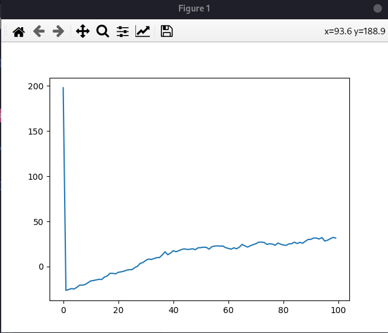
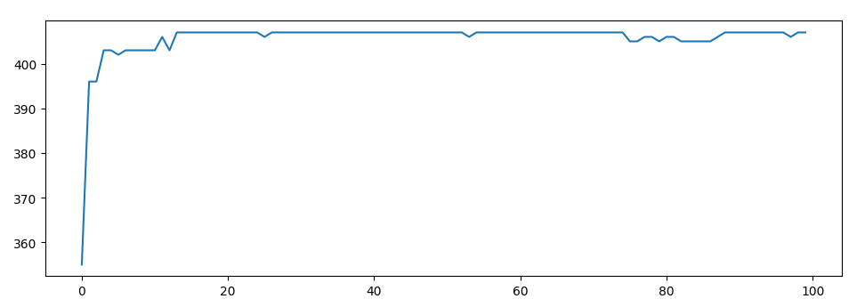
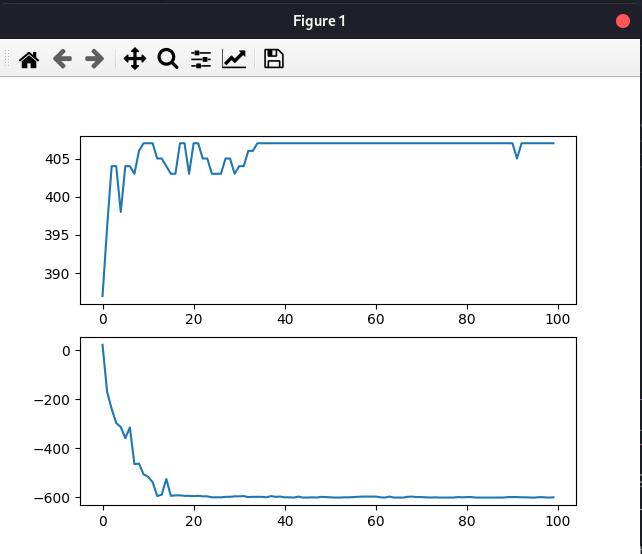
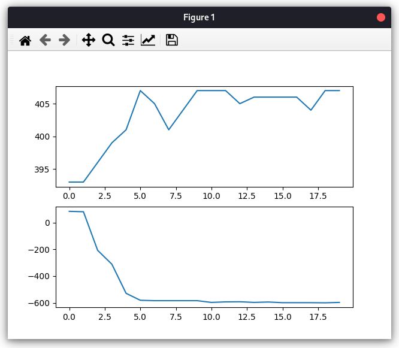
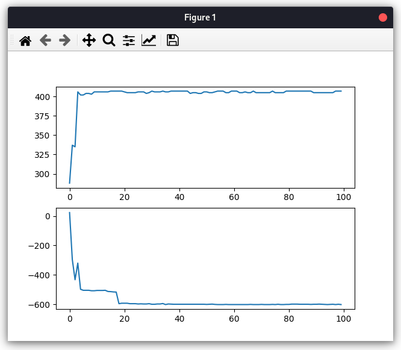
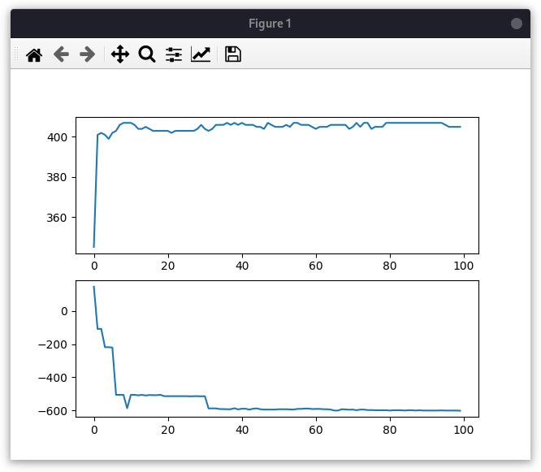

## 1. Introduction
This project is a python implementation of genetic algorithm, accomplishing the goal of parameter optimization of certain functions, to find the extremum in a given x range, as well as visualizing the process of iteration.
## 2. Source Code Descriptions
The package contains four .py files. Genetic_algorithm.py is the main function, while others contain function and classes.
### 2.1 genetic_algorithm.py
This file first creates a individual list named population, filled with 100 generated individuals with random dna. In order to store the best result of each generation, two lists:
max_of_generation = []
min_of_generation = []
was declared.
Then followed by 100 iterations of making new generations to find the maximum, the individual with maximuum fitness in each generation was stored in max_individual_of_generation, its fitness is appended to max_of_generation.
Repeat the same process for minimum.
Now we have two lists filled with 100 the best result of corresponding generation. They were visualized with matplotlib.pyplot. The best individuals' dna were converted to decimal number and presented in terminal.
### 2.2 chromosome.py
This file contains one individual class with a single attribute dna.Individual can be created with or without a given dna sequence.
### 2.3 population_pool.py
generate_population(size): generate an amount of individua with random dna same as size, return a list of individuals.

sort_population_by_fitness(population): sort population by fitness.

choice_by_roulette: I had two approaches for this. The first is to sort population by fitness first in ascending order, so that each individual has a probability (fitness / sum_fitness), as the proportion of roulette.Then generate a random number between 0 and 1, traverse the sorted list and add up summed probability. when the random drawn number is smaller than summed, return the chosen individual.
I came up with another one because sorting is time consuming. This is the optimized version:
in the roulette creation part, each probability simply add the previous one and append to the list, then draw and return the index of the first element greater than drawn. The index corresponds the index of that individual in population as well, so return that individual instead.

crossover(individual_a, individual_b): randomly choose a cut point, make a new dna sequence and return an individual with that dna.

mutate(individual, probability): make the indivual have a chance of probability to flip one of its dna.

make_next_generation(previous_population, mode=): if mode is max, pick two individuals with choice_of_roulette, crossover and mutate. return a list of individuals (population).
if mode is min, then goes the same process, but fitness evaluation would be the opposite.
### 2.4 fitness_function.py
binary_to_decimal(dna): convert any list of zeros and ones to decimal number.
dna_to_number(dna): grab the whole dna, cut into three pieces, convert to decimal number and return all three as a list.
target(individual): target function, to display the result
apply_function(individual): it's the same as target but for fitness evaluations. I created these so that during fitness evaluation we can for example give it a power of 3, to make the roulette selection more polarized, making fitter individuals more likely to be selected. The result will be covered later in the next section.
## 3. Discussion
In the first version, dna was not a sequence of zeros and ones, instead three decimal number x, y, z. Crossover takes the average of two parents, and mutation makes a small random change to dna between (-0.05, 0.05). This approach did not work very well, turned out a random set of dna works better than iterated 100 generations ones. The quelity climbs up later, but even after 10000 generations, it's not as good as our current approach.
			
							The first version's maximum

Later I rewrote the whole code, modulized and made dna binary. It was much better in terms of the result then.

							The second version's maximum

There was one problem left: runtime was very slow since roulette used sort function, result in 10000 iterations of sorting each run. I rewrote the roulette function and it takes only half the time now. Result havn't changed much, but I added minimum feature.
			
							The third final version

The result is already impressive, and the run time only allow you to grab a coffee (about 1 minute). One thing is that as shown above, at some point after the best result is calculated, there's still chance to eliminate the best dna. Thus, in the future, the best 3 of the generation should be preserved.

## 4. Parameters
There are 2 parameters for users to modify: size and generation. Size controls the amount of individuals in population, and generation decides how many iterations there would be.
Here's a typical result of 20 generations: About enough to calculate the result, but the line is still fluctuating.
			
								Result of 20 generations

In terms of size, it's surprising to see 50 does a better job than 100. I ran a few more times to ensure those were not just 50 lucky talented individuals.
			
								Result of size=50 - 1
			
								Result of size=50 - 2

Of course, if the size is too small, it would not satisfy at least half of the population. Here's a typical result of 10:
			
								Result of size=10
As shown above, the expectation was not reached.
In conclusion, more generation leads to a more trust-worthy result, but size is double-edged -- too large of a size causes longer runtime, and sometimes draw down the quality of a few generations.
